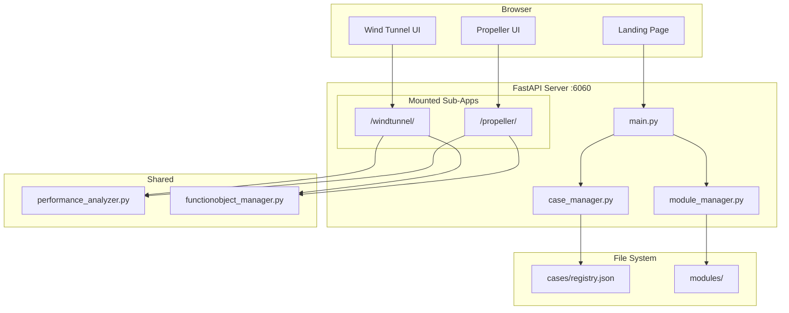
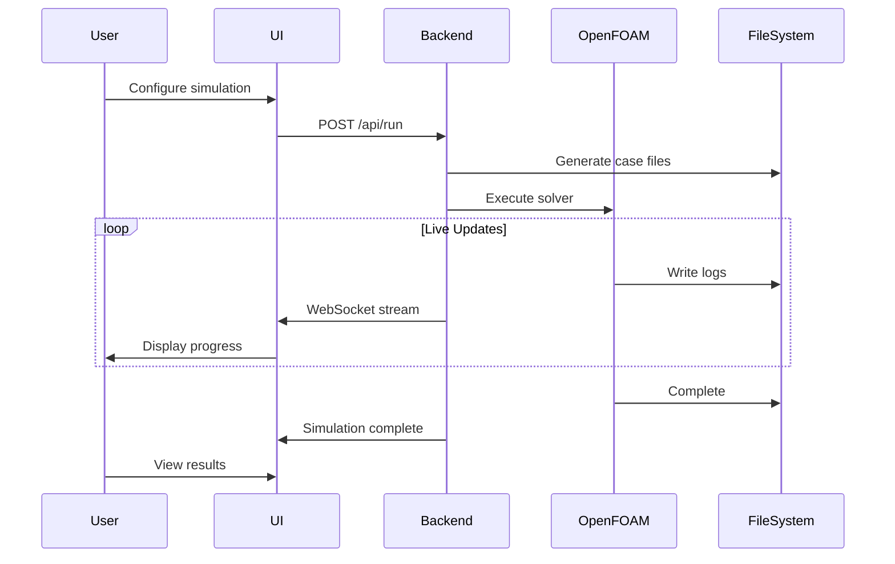
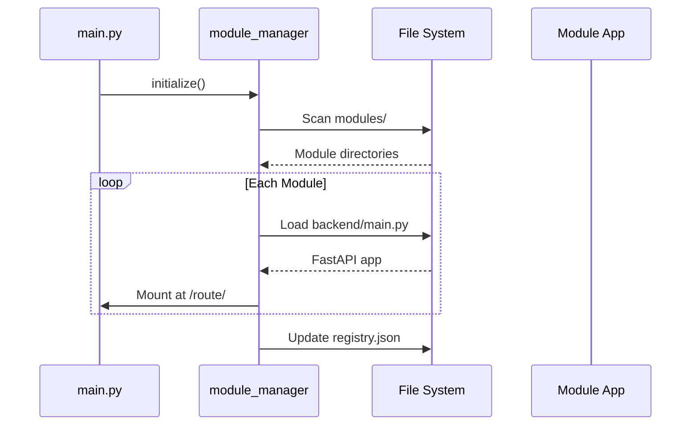

# System Architecture

This document describes the architecture of the OpenFOAM GUI system.

## Overview

OpenFOAM GUI is a web-based application built on FastAPI that provides a unified interface for running OpenFOAM CFD simulations. The system uses a modular architecture where each simulation type (Wind Tunnel, Propeller, etc.) is a self-contained module.

## Component Diagram



## Core Components

### Main Server (`main.py`)

The entry point for the application. Responsibilities:
- Creates FastAPI app with lifespan management
- Serves landing page at `/`
- Exposes case management API at `/api/cases/*`
- Provides global status endpoint at `/api/status`
- Mounts all discovered modules as sub-applications

### Module Manager (`module_manager.py`)

Handles dynamic module discovery and loading:
- Scans `modules/` directory for valid modules
- Validates module structure (requires `backend/main.py`)
- Loads FastAPI sub-apps from each module
- Mounts sub-apps at their configured routes
- Syncs discovered modules with registry

### Case Manager (`case_manager.py`)

Manages the case registry and import/export:
- Maintains `cases/registry.json` with all registered modules
- Validates case directory structure
- Exports cases as ZIP archives
- Imports cases with safety validation
- Updates case metadata (name, icon, description)

## Module Architecture

Each module is a self-contained simulation environment:

```
module_name/
├── backend/
│   ├── main.py          # FastAPI app (exports 'app')
│   ├── workflow.py      # OpenFOAM case generation
│   ├── job_manager.py   # Simulation process control
│   ├── run_manager.py   # Saved runs management
│   └── mesh_library.py  # Mesh file management
├── frontend/
│   ├── index.html       # Main UI
│   ├── css/
│   └── js/
├── templates/           # OpenFOAM case templates
├── module.json          # Module manifest
├── runs/               # Simulation outputs (gitignored)
├── meshes/             # Uploaded meshes (gitignored)
├── logs/               # Log files (gitignored)
└── metadata/           # Run metadata (gitignored)
```

## Data Flow

### Simulation Workflow



### Module Mounting



## Communication

### REST API

Main server endpoints:
- `GET /` - Landing page
- `GET /api/cases` - List all cases
- `POST /api/cases/{id}/export` - Export case
- `POST /api/cases/import` - Import case
- `GET /api/status` - Global simulation status

### WebSockets

Modules use WebSocket connections for real-time updates:
- `/windtunnel/ws/logs/{run_id}` - Live log streaming
- `/propeller/ws/logs/{run_id}` - Live log streaming

## File Storage

| Directory | Purpose | Git Tracked |
|-----------|---------|-------------|
| `modules/*/backend/` | Module code | ✅ Yes |
| `modules/*/frontend/` | Module UI | ✅ Yes |
| `modules/*/templates/` | Case templates | ✅ Yes |
| `modules/*/runs/` | Simulation data | ❌ No |
| `modules/*/meshes/` | Uploaded meshes | ❌ No |
| `modules/*/logs/` | Log files | ❌ No |
| `cases/registry.json` | Module registry | ✅ Yes |

## Related Documentation

- [Modules](modules.md) - Module system details
- [API Reference](api.md) - Endpoint documentation
- [Development](development.md) - Creating new modules
