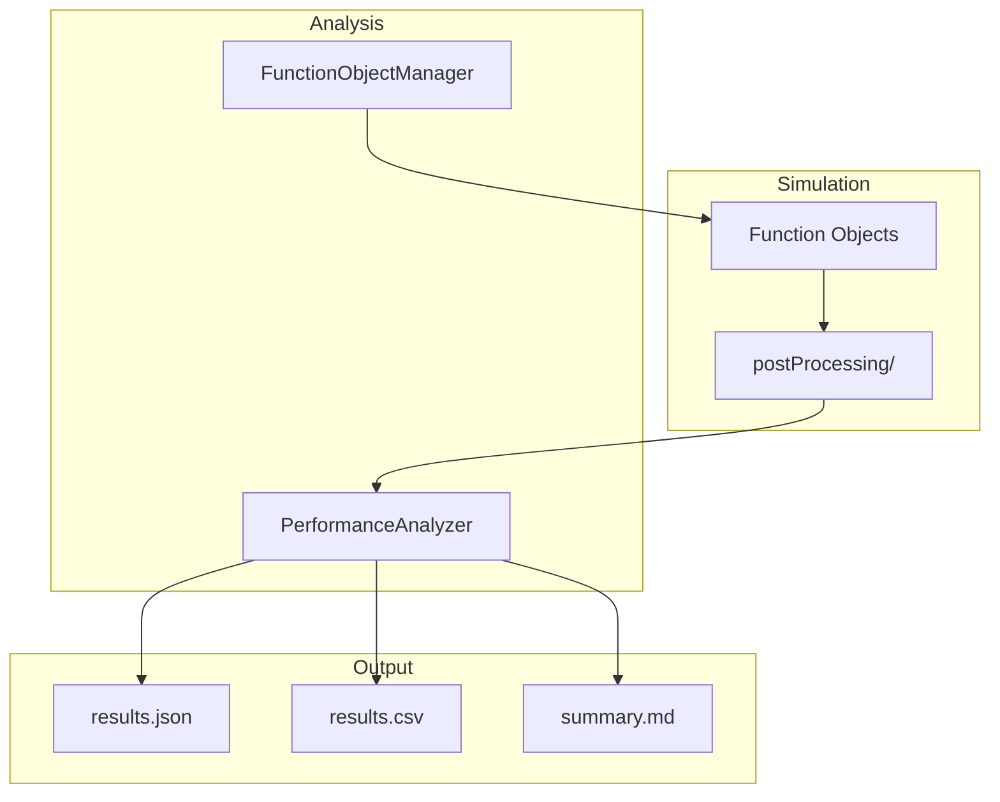

# Performance Analysis

This document describes the performance analysis system used to extract metrics from OpenFOAM simulations.

## Overview

The performance analysis system automatically extracts forces, moments, and coefficients from completed simulations. It uses OpenFOAM's function objects to log force data during simulation, then post-processes the results.

## Architecture



## Components

### FunctionObjectManager (`shared/functionobject_manager.py`)

Generates and injects OpenFOAM function objects into `controlDict`:

**Forces Function Object:**
```cpp
forces1
{
    type            forces;
    libs            (forces);
    writeControl    timeStep;
    writeInterval   1;
    
    patches         (model);
    rho             rhoInf;
    rhoInf          1.225;
    
    CofR            (0 0 0);
}
```

**Force Coefficients Function Object:**
```cpp
forceCoeffs1
{
    type            forceCoeffs;
    libs            (forces);
    writeControl    timeStep;
    writeInterval   1;

    patches         (model);
    rho             rhoInf;
    rhoInf          1.225;
    
    magUInf         10;
    lRef            1.0;
    Aref            1.0;
    
    CofR            (0 0 0);
    liftDir         (0 0 1);
    dragDir         (1 0 0);
    pitchAxis       (0 1 0);
}
```

### PerformanceAnalyzer (`shared/performance_analyzer.py`)

Post-processes force data from OpenFOAM output.

#### Patch Detection

Automatically detects geometry patches from `constant/polyMesh/boundary`:
- Uses fuzzy matching against candidate keys (e.g., "model", "wing", "rotor")
- Excludes known boundary patches (inlet, outlet, walls)
- Reports confidence scores

#### Force Parsing

Reads OpenFOAM force output files:

| File | Columns |
|------|---------|
| `force.dat` | Time, Pressure Force (x,y,z), Viscous Force (x,y,z), Porous Force (x,y,z), Pressure Moment (x,y,z), Viscous Moment (x,y,z) |
| `coefficient.dat` | Time, Cd, Cs, Cl, CmRoll, CmPitch, CmYaw, Cd(f), Cd(r) |

#### Time Averaging

Supports multiple analysis modes:

| Mode | Description |
|------|-------------|
| Latest | Use final time step values |
| Average | Average over all time steps |
| Windowed | Average over time range [t_start, t_end] |
| Exclude Initial | Skip initial transient (e.g., first 20%) |

## Wind Tunnel Metrics

| Metric | Description | Formula/Source |
|--------|-------------|----------------|
| Drag (Fx) | Force in flow direction | Σ(pressure + viscous) in x |
| Lift (Fz) | Force perpendicular to flow | Σ(pressure + viscous) in z |
| Side Force (Fy) | Lateral force | Σ(pressure + viscous) in y |
| Cd | Drag coefficient | From forceCoeffs |
| Cl | Lift coefficient | From forceCoeffs |
| Cm | Moment coefficient | From forceCoeffs |

## Propeller Metrics

| Metric | Description | Formula |
|--------|-------------|---------|
| Thrust | Axial force | Fz (along rotation axis) |
| Torque | Moment about axis | Mz |
| Power | Mechanical power | Torque × ω |
| Efficiency | Propulsive efficiency | (Thrust × V) / Power |
| Kt | Thrust coefficient | T / (ρ n² D⁴) |
| Kq | Torque coefficient | Q / (ρ n² D⁵) |

## Output Formats

### JSON (`results.json`)

```json
{
  "metrics": {
    "drag": {"value": 12.5, "unit": "N"},
    "lift": {"value": 45.2, "unit": "N"},
    "cd": {"value": 0.025, "unit": ""},
    "cl": {"value": 0.092, "unit": ""}
  },
  "analysis": {
    "method": "time_average",
    "start_time": 0.8,
    "end_time": 1.0,
    "samples": 200
  }
}
```

### CSV (`results.csv`)

```csv
metric,value,unit
drag,12.5,N
lift,45.2,N
cd,0.025,
cl,0.092,
```

### Markdown (`summary.md`)

Human-readable summary with formatted tables.

## Usage

### API Call

After simulation completes:

```javascript
const response = await fetch('/windtunnel/api/runs/{run_id}/performance');
const metrics = await response.json();
```

### Accessing Results

Results are stored in:
```
runs/{run_id}/performance/
├── results.json
├── results.csv
└── summary.md
```

## Configuration

Pass analysis configuration when requesting metrics:

```json
{
  "average": true,
  "exclude_fraction": 0.2,
  "patches": ["model"],
  "directions": {
    "lift": [0, 0, 1],
    "drag": [1, 0, 0]
  }
}
```

## Troubleshooting

### No forces data

- Check `postProcessing/forces/` exists
- Verify `controlDict` has forces function object
- Ensure simulation ran long enough

### Wrong patches detected

- Check `constant/polyMesh/boundary` for patch names
- Specify patches explicitly in configuration

### Averaged values unstable

- Increase `exclude_fraction` to skip more transient
- Use windowed averaging with converged time range

## Related

- [Wind Tunnel](wind_tunnel.md)
- [Propeller](propeller.md)
- [API Reference](api.md)
